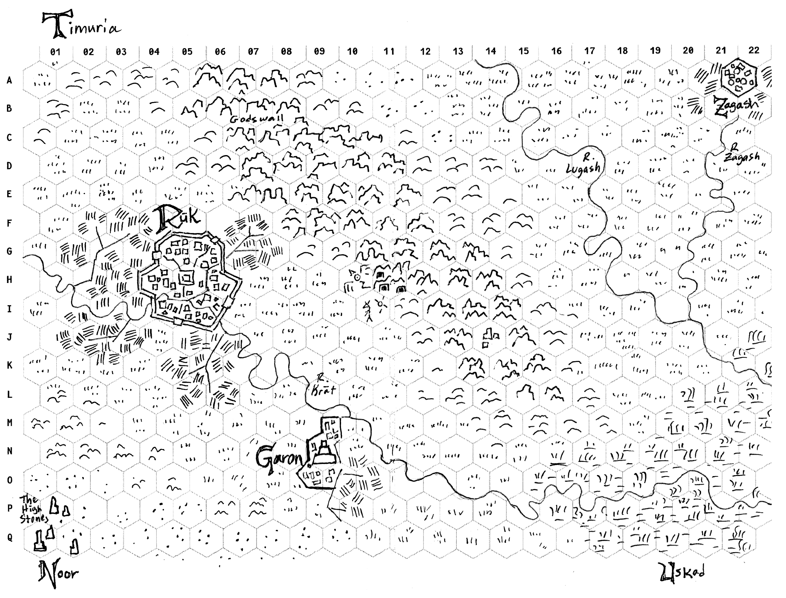

# Settimana 2: L'area circostante

*Mappare il terreno intorno al dungeon e alla città.*

Gygax suggerisce di "sedersi con un grande pezzo di carta a esagoni e disegnare una mappa su larga scala. Una mappa con una scala di 1 esagono = 1 miglio ... sarà più o meno giusta per le operazioni dei giocatori come esplorare, accamparsi, avventurarsi ed eventualmente costruire le loro roccaforti. Anche piccole cose come la capanna di una strega e gli ingressi laterali al dungeon possono essere mostrati sulla mappa. Le caratteristiche centrali della mappa devono essere la città principale e l'entrata del dungeon". - EGG

### Compiti
- **Prendi un foglio di carta a esagoni**. Disegnaci sopra quanto segue, un elemento per esagono (o di più se indicato). Dai un nome a tutto ciò che merita un nome. Se non ti senti a tuo agio a disegnare, sono disponibili molti programmi di hex-mapping!
- Un insediamento di dimensioni significative
- Due altri insediamenti (accampamenti, città più o meno grandi, un torrione, la casa insolita di una razza di fantasia, ecc.)
- Un elemento di terreno importante (che copra almeno tre esagoni)
- Un luogo misterioso da esplorare
- Un ingresso (principale) al dungeon

### Riguardo alla scala
Se la tua carta a esagoni contiene 23x14 esagoni, in scala 1:1 (miglia per esagono) l'area rappresentata sarebbe pari a 322 mi², circa la metà della grandezza della Grande Londra. Una scala 1:6 rappresenterebbe 12.432 mi², circa 1/3 delle dimensioni dell'Irlanda. Sarai tentato di "fare le cose in grande" perché ti farai prendere dalla costruzione del mondo piuttosto che definire semplicemente un'area in cui avventurarvi. Resta concentrato. Scale più grandi di 1:6 dovrebbero essere scartate a priori. Ci sarà tempo per disegnare una mappa in scala maggiore nella settimana 5.

### Crediti extra
- Migliora la tua mappa. Macchiala di caffè, brucia un po' i bordi o aggiungi del colore. Questo farà sentire la tua mappa come un vero documento e/o le darà presenza al tavolo.
- Crea una tabella degli incontri casuali. Fai una tabella di 2d6 (11 slot numerati da 2 a 12). Metti gli incontri meno pericolosi/più comuni al centro della tabella e quelli più rari in cima e in fondo alla lista. Considera di preparare alcuni degli incontri dei PNG interessanti. E includi agganci per l'avventura, come "Tre goblin che saccheggiano il cadavere di un nobile morto. I personaggi potrebbero recuperare il corpo e/o l'anello con sigillo per una ricompensa".

## Esempi

### La Hex Map di Timuria
Dopo aver disegnato questo schizzo di Timuria, una regione di Uzrak, mi sono reso conto che aveva una scala strana. Ho iniziato con le città e una scala di 1 miglio per esagono nella mia testa. Mentre disegnavo le lande selvagge, ho involontariamente spostato la scala e stavo pensando in esagoni di 3 o addirittura 6 miglia. Il risultato è una mappa con una sorta di scala cartografica primitiva, dove le cose più importanti sono più grandi. È così che gli errori diventano caratteristiche interessanti!

### Tabella degli incontri casuali

| 2d6 | Creatura                   | Aggancio                                                                                                                                                                                  |
|-----|----------------------------|-------------------------------------------------------------------------------------------------------------------------------------------------------------------------------------------|
| 2   | Sfinge, Avatar dell'Ordine | L'avatar sfida gli avventurieri con la logica (sotto forma di indovinello) e si avventa su coloro che non possono rispondere; supponendo che le loro menti siano contaminate dal Caos.    |
| 3   | Manticora                  | Una manticora rabbiosa ha perso la sua sanità mentale. Si aggira per le pianure massacrando tutto ciò che incontra per dispetto.                                                          |
| 4   | Centauri                   | Un branco di d6+1 centauri sta cacciando un fuggitivo: un umano che ha deturpato il totem della sua tribù.                                                                                |
| 5   | Pattuglia                  | Una pattuglia di d6+2 guardie di una città vicina si ferma e vi interroga su un uomo con un occhio solo in armatura cremisi.                                                              |
| 6   | Carovana                   | Una fila di d6 carri, ognuno con un conducente, 2 guardie e d3 occupanti, attraversa la pianura. Sono alla disperata ricerca di una fonte d'acqua.                                        |
| 7   | Banditi                    | 2d6 teppisti a cavallo di becchi d'ascia vi inseguono nella speranza che abbiate armi di ferro o attrezzi da rubare. Si accontenteranno delle vostre monete.                              |
| 8   | Mangiatori di carne        | Una lurida banda di d6+4 mangiatori di carne si avvicina, volendo scambiare curiose reliquie che hanno trovato nelle caverne di Godswall. Osservano avidamente qualsiasi malato o debole. |
| 9   | Cavaliere del Caos         | Un cavaliere del Caos (coperto da un'armatura appuntita) sta cercando di impressionare il suo dio e sfida il più forte rappresentante della legge tra di voi in un combattimento singolo. |
| 10  | Popolo Serpente            | Un gruppo di uomini serpente (d6+1), che si muove sotto la copertura delle tenebre, sta portando un messaggio in codice ad un cultista di Garon.                                          |
| 11  | Arpie                      | Un branco di arpie (d3 + la taglia del gruppo) attacca l'accampamento in due ondate, fingendo di attirare le guardie e rubando tutti i "brillanti" su cui riescono a mettere gli artigli! |
| 12  | Signore dei Vampiri        | Un vampiro che cavalca un orrore volante di carne modellata vi scorge. Quante possibilità ci sono che torni durante la notte o quando sieti debole?                                       |